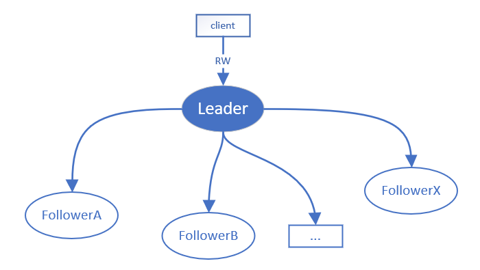

<!-- PROJECT SHIELDS -->


<!-- TABLE OF CONTENTS -->
## Table of Contents

* [About the Project](#about-the-project)
* [Getting Started](#getting-started)
  * [Prerequisites](#prerequisites)
  * [Building](#building)
  * [Usage](#usage)
* [Contributing](#contributing)
* [License](#license)
* [Contact](#contact)
* [Donation](#donation)

<!-- ABOUT THE PROJECT -->
## About The Project

**Aurora is a cross-platform [Raft](https://raft.github.io) based K-V database**. The basics of the current architecture is :



*Note : The name `Aurora` **has nothing to do with** neither [Apache Aurora](http://aurora.apache.org/) nor [Amazon aurora](https://aws.amazon.com/rds/aurora/).*

It's inspired by the  [raft protocol](https://raft.github.io) which often being known as a contrast of another widely known protocol : `paxos`. Aurora comes along with all of raft dominant features supported:
* **Log Replication**: A two phase commit data replication solution.
* **Leader Election** : A majority & term based failover solution.
* **Membership Change**: A smart approach dealing with cluster topology changing.

Besides the consensus protocol, it also comes with a local storage subsystem whose idea is inspired and being the same with [leveldb](https://github.com/google/leveldb) : to enhance blind writing operation throughput.

Last but not least, it's implemented by using the modern cpp(11/14/17) which may contributes to the popularization of the new lanaguage standards. After all, newer is probably better.

<!-- GETTING STARTED -->
## Getting Started

Project root directory explanation:
* src : source code.
* doc : documents.
* bin : binaries & objects after successfully building.
* working : running directory of aurora.
* third_party : the third party dependencies.

Aurora has some basic components you need to firstly building before running.

### Prerequisites

* [protobuf](https://github.com/protocolbuffers/protobuf). >=3.0.0.
* [grpc](https://github.com/grpc/grpc). >=1.8.x.
* [boost](https://www.boost.org/). >=1.64.0.
* [glog](https://github.com/google/glog). >=0.3.3.
* [gflags](https://github.com/gflags/gflags). >=2.2.0.
* [gtest](https://github.com/google/googletest). >=1.7.0.
* [gperftools](https://github.com/gperftools/gperftools). >=7.0.

Create a `third_party` directory and build the above dependencies under that.

*Note: How to build the dependencies is beyond the scope and you may need consulting the documents for each of them. Making sure the headers and libraries are correctly installed on your system. That maybe boring but can't get around.*

After successfully built all the above dependencies, your working directory should looks something like this:
```
|-- src
|-- doc
|-- bin
|-- working
|-- third_party
    |-- boost_1_68_0
    |-- protobuf
    |-- grpc
    |-- glog
    |-- gflags
    |-- googletest
```

### Building
Now, you are ready to compile aurora itself.

* unix & linux & osx:
```console
cd aurora && make -j4
```

> Note: some gcc versions(like gcc (GCC) 8.3.1) don't fully support std::atomic, thus you might need to install `libatomic` manually.

* windows:
see [building under windows](doc/windows.md)

<!-- USAGE EXAMPLES -->
## Usage

First , take a look at the configure files:
* `election.config` : inner usage for election.
* `membership-change.config` : inner usage for membership change.
* `topology.config` :  setup a cluster:
  * `leader` :leader node.
  * `followers` :follower nodes.
  * `candidates` :follower nodes.
  *  all nodes are with format : `xx.xx.xx.xx:port`,like `192.168.0.100`.

*Only `topology.config` is intending to be controlled by users, the others are either managed by the system or for debugging purpose.*

Second, after finish configuring `topology.config`, you can start a node by :
* running command under *nix:

```console
  cd aurora/working/
  nohup ../bin/aurora > aurora.log 2>&1 &
```

* runing command under windows:

```console
cd aurora\working\
..\aurora\working\aurora.exe
```


<!-- CONTRIBUTING -->
## Contributing
It is strongly recommended to read the [developer guide](doc/developer_guide.md) for details.

<!-- LICENSE -->
## License
Distributed under the **GPLv3** License. See the [license file](LICENSE) for more information.

<!-- CONTACT -->
## Contact
Arthur - pplorins@gmail.com


## Donation
This project consumed a lot time away from the author, and if you think it helps, don't hesitate to show your generosity :moneybag: :moneybag: :moneybag:

* paypal: [paypal.me link](https://www.paypal.me/arthurCoo)
* wechat:

   
   
* alipay:

  


