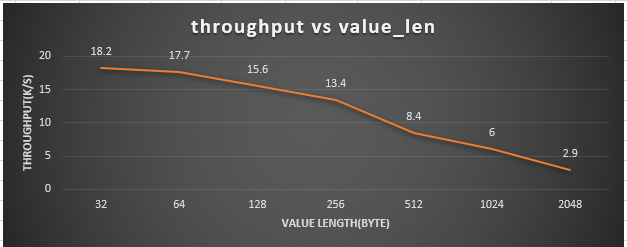
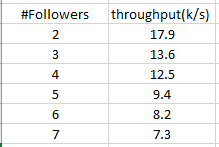

# Benchmark

This is the environment for benchmark.

### Machines:

|machine|OS|Compiler|Cpu|Memory|Disk|
|--|--|--|--|--|--|
|machineA|win10 64 pro|MSVC 19.00.24215.1 for x86|i7 8(4*2)core 4.0GHZ|16G|SSD|
|machineB|Mac 64 High Seria 10.13.6|Apple LLVM version 10.0.0 (clang-1000.10.44.4)|i7 8(4*2)core 2.2GHZ|16G|SSD|

### Network: 
Home router: tplink TL-WR880N 450Mbps. Latency:
* machineA --> machineB : 1~100ms(unstable)
* machineB --> machineA : 1~5ms(stable)

### Depoly: 
Leader is deployed on machineA, all followers are deployed on machineB.

### Config:

#### leader config:
--do_heartbeat=false --iterating_wait_timeo_us=2000000 --port=10010 --leader_append_entries_rpc_timeo_ms=5000 --leader_commit_entries_rpc_timeo_ms=5000 --client_cq_num=2 --client_thread_num=2 --notify_cq_num=2 --notify_cq_threads=4 --call_cq_num=2 --call_cq_threads=2 --iterating_threads=2 --client_pool_size=400000

#### follower config:
--checking_heartbeat=false --iterating_wait_timeo_us=50000 --disorder_msg_timeo_ms=100000 --port=$\{port\} --notify_cq_num=1 --notify_cq_threads=4 --call_cq_num=1 --call_cq_threads=4 --iterating_threads=2 

### Logic

Using the `TestLeaderServiceClient.Benchmark` test case in `src\gtest\service\test_leader_service.h` with arguments:    --gtest_filter=TestLeaderServiceClient.Benchmark --client_write_timo_ms=5000 --benchmark_client_cq_num=1 --benchmark_client_polling_thread_num_per_cq=2 --leader_svc_benchmark_req_count=80000 --benchmark_client_entrusting_thread_num=1

Which is, sending 4w requests in an asynchronous way, counting overall write throughput. (Reading performance is not considered here). The influential factors being tested are : **data length** and **number of followers**.

### About latency:
First of all, the latency for a specific reqeust comprises three parts:
* round trip time on the network.
* waiting to be processed on the serer side, especially under heavy loads. This is usually implemented with a queue that holding the requests.
* the business logic processing time, in raft, it usually contains of :
  * appending logs.
  * replicating requests to the majority of the cluster.

If we saturating the server, the time spending on the second part will drastically increasing, resulting in a high average latency but that number is meaningless since measuring latency containing `part2` cannot truly reflecting the real processing abilities of the server, what it can only tell about us is that : *Oh, man, the server have already doing its best now..*. And any kind of server will get a point like that when it reach it's processing limitations. So here when we're talkng about latency we only forcus on the time spending on `part1 + part3`.

### Result:

#### Taking **data length** as the factor:

#### Taking **number of followers** as the factor:

Latency result under windows-mac case is unreliable since the network is unstable. 

> ##### Result under linux:
> * Throughput result under linux generally greater than the above result for ~50%-70%. 
> * Latency result under linux is stable at 1ms~2ms for all the above cases.

### Bottleneck analysis:
First, let write an example to see the performance when there is no logic but only grpc framework.
* leader: receive requests from client and broadcasting them to its followers, here we got 2 followers.
* follower: ping-pong server, do nothing but return an empty msg upon receiving requests from the leader.

Leader's code is [here](https://gist.github.com/ppLorins/d72272b6f79c580c25a88a5bb3e489d0).

We'll get a result of **~2.0w/s** throughput under the same environment and deployment. So we can almost concude that the **bottleneck is on the grpc framework itself** according to this experiment. Better practices for how to utilize grpc is still hard to figure out due to grpc is not as good as you might imagine.

