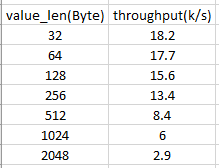

# Benchmark

This is the environment for benchmark.

### Machines:

|machine|OS|Compiler|Cpu|Memory|Disk|
|--|--|--|--|
|machineA|win10 64 pro|MSVC 19.00.24215.1 for x86|i7 8(4*2)core 4.0GHZ|16G|SSD|
|machineB|Mac 64 High Seria 10.13.6|Apple LLVM version 10.0.0 (clang-1000.10.44.4)|i7 8(4*2)core 2.2GHZ|16G|SSD|

### Network: 
Home router: tplink TL-WR880N 450Mbps. Latency:
* machineA --> machineB : 1~100ms(unstable)
* machineB --> machineA : 1~5ms(stable)

### Depoly: 
Leader is deployed on machineA, all followers are deployed on machineB.

### Config:

#### leader config:
--do_heartbeat=false --iterating_wait_timeo_us=2000000 --port=10010 --leader_append_entries_rpc_timeo_ms=5000 --leader_commit_entries_rpc_timeo_ms=5000 --client_cq_num=2 --client_thread_num=2 --notify_cq_num=2 --notify_cq_threads=4 --call_cq_num=2 --call_cq_threads=2 --iterating_threads=2 --client_pool_size=50000

#### follower config:
--checking_heartbeat=false --iterating_wait_timeo_us=50000 --disorder_msg_timeo_ms=100000 --port=${port} --notify_cq_num=1 --notify_cq_threads=4 --call_cq_num=1 --call_cq_threads=4 --iterating_threads=2 

### Logic

Using the `TestLeaderServiceClient.Benchmark` test case in `src\gtest\service\test_leader_service.h` with arguments:   --gtest_filter=TestLeaderServiceClient.Benchmark --client_write_timo_ms=10000 --benchmark_client_cq_num=1 --benchmark_client_thread_num_per_cq=1 --value_len=1 --leader_svc_benchmark_req_count=20000

Which is, using asynchronous way of sending 2w requests each time, counting overall write throughput & average write latency. Reading performance is not considered. The influential  factors being tested are : **data length** and **number of followers**.

### Result:

#### Taking **data length** as the factor:

#### Taking **number of followers** as the factor:

### Bottleneck analysis:
If we remove all the logics leaving only the skeleton(where leader broadcasting requests to all its followers) left, we'll get a result of ~2w throughput & ~500ms latency. After a more detailed investigation, you'll find that it's `UnaryAsyncClient<T,R,Q,CQ>::EntrustRequest()::this->m_reader->Finish` that made the watershed, probably because it would trigger the broadcasting process to the followers which further bring a performance drawback. So the **bottleneck is on the grpc framework itself** under my experiments. Better practices for how to utilize grpc is needed.

