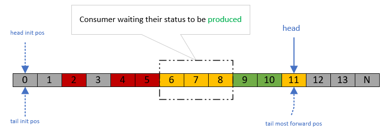
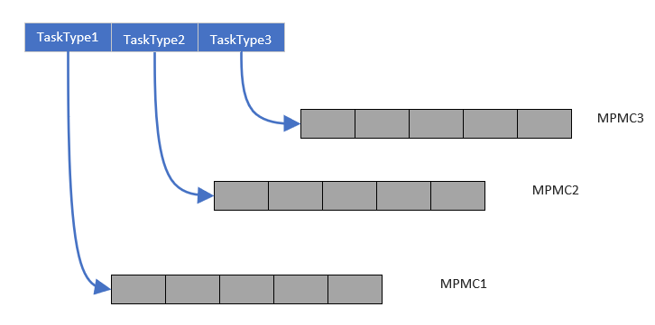
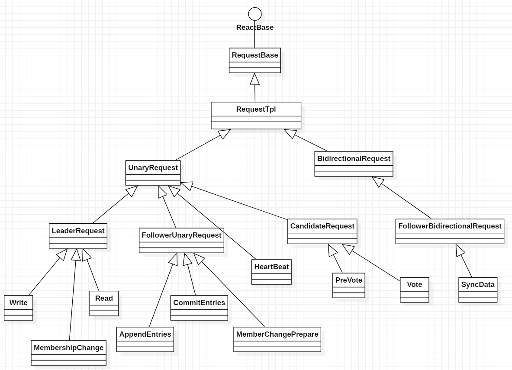
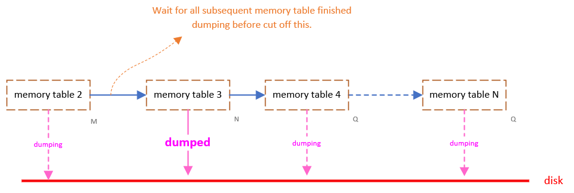

# Developer guide 

<!-- TABLE OF CONTENTS -->
## Table of Contents

* [Architecture Overview](#architecture-overview)
  * [Overview](#overview)
  * [About the RPC](#about-the-rpc)
    * [RPC framework](#rpc-framework)
    * [Asynchronous in GRPC](#asynchronous-in-grpc)
    * [RPC interfaces](#rpc-interfaces)
* [Details Design](#details-design)
  * [Data Structures](#data-structure)
    * [Trivial lock double list](#trivial-lock-double-list)
    * [Trivial lock single list](#trivial-lock-single-list)
    * [Lockfree hash](#lockfree-hash)
    * [Lockfree deque](#lockfree-deque)
    * [Lockfree MPMC queue](#lockfree-mpmc-queue)
    * [Lockfree priority queue](#priorify-queue)
  * [Basic workflow](#basic-workflow)
    * [Follower workflow](#follower-workflow)
    * [Leader workflow](#leader-workflow)
      * [Connection pool](#connection-pool)
      * [Client pool](#client-pool)
      * [Workflow anatomy](#workflow-anatomy)
  * [Asynchronous Framework](#asynchronous-framework)  
    * [Threading model](#threading-model)
    * [Parallel Replicating](#parallel-replicating)
    * [CGG problem](#the-cgg-problem)
    * [Lifetime management](#lifetime-management)
  * [Global Timer](#global-timer)
  * [About The Binlog](#about-the-binlog)
    * [Meta data](#meta-data-part)
    * [Data part](#data-part)
    * [Supported operations](#supported-operation)
  * [Storage Layer](#storage-layer)
  * [Election](#election)
    * [The basics](#the-basics)
    * [About prevoting](#about-prevoting)
    * [The live lock problem & solution](#the-live-lock-problem--solution)
  * [Membership Change](#membership-change)

* [Contributing](#contributing)
  * [Future Work](#future-work)
  * [Naming Conventions](#naming-conventions)
  * [Unit Test](#unit-test)
  * [Development history](#dev-his)
  

<!-- ABOUT THE PROJECT -->
## Architecture Overview

### Overview

As you can see in the [README](../README.md) file , aurora's cluster structure has nothing special than a 
typical raft cluster ,it has a leader exposed to the clients serving their read & write(only 
[blind writing](https://en.wikipedia.org/wiki/Blind_write) is supported for now) requests.


### About the RPC 

#### RPC framework

The RPC framework for each running node is [google's grpc](https://github.com/grpc/grpc), main benefits enjoyed by choosing it from the others are :
* taking the advantage of the event-driven asynchronous IO model.
* utilizing multi cores with its multithreading model which is even customizable.
* the sophisticated serialization solution : [protobuf](https://github.com/protocolbuffers/protobuf).
* rich documents come in many ways.

If we choose the grpc as the underlying network library , one important thing should be clearly understood, that is the difference of its `synchronous model` and `asynchronous  model`. In  short:
* synchronous : user cannot manage the application level threads. 
* asynchronous : It's user's duty to control the application level  threads.

In the synchronous model, the fixed threading model makes programmers' life easier by telling them that you just need to fill in the virtual RPC interfaces. This is pretty good in many ways, but not for all.

In the asynchronous model, by allowing the programmers to customize the threading model, a grpc node can be fully event-driven whereas the synchronous model cannot. This further is achieved by **utilizing the `CompletionQueue`** .[This talk](https://groups.google.com/forum/#!topic/grpc-io/DuBDpK96B14) is great 
helpful and worth reading carefully. For more information about the how does the grpc core's polling mechanism work, look at [this](https://github.com/grpc/grpc/blob/master/doc/core/epoll-polling-engine.md).

#### Asynchronous in GRPC

There is no abundant materials telling people about how to desing an asynchronous server except [the simple official example](https://grpc.io/docs/tutorials/async/helloasync-cpp/). It's a time consuming work to find out the correct way of writing an asynchronous c++ grpc server, especially for the *bidirectional streaming* version. Talking about it in detail is beyond this topic, here are some examples one can consulting into when he wants to have a basic understanding of how it works:
* a simple asynchronous grpc c++ server, says *S<sub>A<sub>*, check [this](https://gist.github.com/ppLorins/d75e60dbbbbd84e218928d9fe6781869).
* a bidirectional stream asynchronous grpc c++ server, says *S<sub>B<sub>*, check [this](https://gist.github.com/ppLorins/6e4cc625c2c5b8fd16ced3172b1ada09).
* a mixed asynchronous version of *S<sub>A<sub>* and *S<sub>B<sub>*, check [this](https://gist.github.com/ppLorins/d3392111992097c68454e9381d53b446).
* a proxy server for forwarding the unary and bidirectional stream request to *S<sub>A<sub>* and *S<sub>B<sub>*, this is the most complicated one for it demonstrates how to do client reacting together with server reacting, and this is exactly the way how does the aurora's leader works, check [this](https://gist.github.com/ppLorins/6b492beadecd07eddcd0b548ea0d12c9).

And there are several implicit behaviors(or even pitfalls) you need to pay attention to when developing, here are a list of them:
* `CompletinQueue` delivering messages to the application in a reversed order as opposite to client entrusting, check [this](https://github.com/grpc/grpc/issues/19658). This can lead to message coming in a bad disorder sequence, increasing the possibility of `AppendEntries` timeout on the follower side since the order plays an important role in the whole `Log Replication` process.
* <a name="client-timeout-if-dont-fetch"></a> c++ async client unexpectly timeout if I don't call `CQ::Next()`, check [this](https://github.com/grpc/grpc/issues/19573). The downside of this behavior is that it forces us to fetch the RPC result ASAP when there is result waiting to be fetched, otherwise a timeout error would be thrown by grpc eventhough there is actually no timeout happened at all. To adapt, dedicated CQs and threads for client reacting are introduced.
* calling the server side's [grpc::ServerAsyncReaderWriter< W, R >::Finish](https://grpc.github.io/grpc/cpp/classgrpc_1_1_server_async_reader_writer.html#a75342152acd961b7fcf1317bec0b8c3a) interface will trigger twice notifications immediately on the server side, check [this](https://github.com/grpc/grpc/issues/17222) and [this](https://github.com/grpc/grpc/issues/19159), I suppose their meanings might be:
  
    * First notification: the final status set by the server has already been sent to the wire.
    * Second notification: the stream has already been closed now.
  
    Thus if there are multiple threads polling on the same CQ, a synchronization between them is need.

#### RPC interfaces

The RPC interfaces are defined in [the protocol file](../src/protocol/raft.proto),you can see all the internal logic between the leader and followers, here is a short brief of them:

* For Client & Admin :
  * `Read` :  for client invoking , read request.
  * `Write` :  for client invoking , write request.
  * `MembershipChange` :  for admin invoking , topology changing request.

* For Log Replication :
  * `AppendEntries` :  Log replication 2PC's phaseI.
  * `CommitEntries` :  Log replication 2PC's phaseII.
  * `SyncData` :  re-sync all data from leader to follower,this will erase all existing data first on the follower side .

* For Election :
  * `PreVote` :  an additional step before starting the real election process to prevent few false-failure nodes from disrupting the entire cluster by issuing new rounds of election.
  * `Vote` :  candidate requesting votes from the others.
  * `HeartBeat` :  doing heartbeat.

* For Membership change:
  * `PropagateMemberChange` :  membership change phaseI.
  * `MemberChangeCommit` :  membership change phaseII.

## Details Design

This section describing the fundamental concepts and components.

### Data Structure

Since `grpc` is multi-threaded,  the business threads should considering the thread-safety problems for almost all of its operations , therefore some lockfree data structures must be introduced to fit the needs. 

*Note : Nearly all of the code for CAS operations in Aurora are using the `std::atomic::compare_exchange_strong` api instead of `std::atomic::compare_exchange_weak`, exchanging for readability with little acceptable performance payment.*

#### Trivial Lock Double List

This is a doubly linked **sorted** list.  It support two primary operations:
* Insert : insert at a proper position based on the new node's  value.
* Cuthead : find the longest continuous sublist from head and cut it off from the list containing it.(This demand is the most peculiar one out of all the data structure operations.)

Relationship between the two operations:

* Insert vs Insert is lock free.
* Insert vs Cuthead is lock free.
* Cuthead vs Cuthead need to be exclusive from each other, this is where locking exists and the name prefix `trivial` comes from.

The `TrivialLockDoubleList` always having a `Head Node` representing the minimum value of the template type of the list and a `Tail Node` representing the maximum value. This sets both the lower and upper boundaries for a certain list instance, getting rid of dealing with corner cases for inserting and cutting head operations.

We'll see how they the lockfree semantics are implemented step by step :

##### 1. Inserting at different positions.
This is the simplest and most common case , no worries about multiple thread doing this at the same time, since there are no conflicts could exist :


Insert operations in this case will get finished correctly and independently :


##### 2. Inserting at the same position.

Think about how to deal with the following case in a lockfree way ?


I believe plenty of solutions might have been invented although I didn't consult any of them: I figured out my own version and the answer cannot being as difficult as you might thought if you following the rules:

###### <a name="R1"></a> R1. Steps of race condition operation must each *strictly following a same order*.
###### <a name="R2"></a> R2. Repeat the operations from the right place when conflicts are detected.

*Note: The above two principles are not only applies to `TrivialLockDoubleList` but also all of the other lockfree data structures in aurora.*

Taking a closer look at it :

* **Step 1**, make the `pre` and `next` pointer of the new node pointing to its neighbours. E.g.  `Node 13`'s `pri` and `next` pointer pointing to `Node 11` and `Node max` respectively in the above picture.

* **Step 2**, the previous node's `next` pointer switching its target from the next node to new node(CAS). E.g. `Node 11`'s `next` now pointing to `Node 15`, switched from pointing to `Node max`:
  
  
  * If the above CAS fails,meaning there are other threads are **doing exactly the same thing at the same position**, conflicts are detected and the thread inserting `Node 13` will start **iterating from `P_NEXT` again**,  conforms [R2](#R2) :
  
  
  * It could fail for a second time for the thread inserting `Node 13` when retrying:
  
  but doesn't matter, just repeat until succeed.
  
* **Step 3**, the next node's `pri` pointer switching its target from the previous node to new node(CAS). E.g. `Node max`'s `pri` now pointing to `Node 15`, switched from pointing `Node 11`:


  * After that, the thread inserting `Node 13` will recognize that current position is not correct anymore(by founding 15 > 13 ), therefore it goes ahead toward `Node min`'s' direction and will eventually find that the new right position for `Node 13`: between `Node 11` and `Node 15`, deciding to insert `Node 13` there.
  
  * This picture also illustrated that by following the above steps **all the conflicts among those threads will eventually get resolved** as the involved threads will either :
  
    * **win a CAS contention** : so it can proceed on or
    * **fail a CAS contention** : it will retry and letting others go ahead.
    
    Neither of the two behaviors will result in an invalid coming out, the only downside is on performance : the cost of retrying.
    
This achievement can be generally named as `thread re-conciliating` as the result of following [R1](#R1) and [R2](#R2), and is the **essential factor of how threads could cooperating correctly with each other**.

Finally, reconsidering for a while about the above procedure, there is no point of view where race 
condition could happen, also thanks to the CAS semantics.

*Note : Understanding the knowledge described above especially for [R1](#R1) and [R2](#R2) are critical to read the following data structure sections.*

##### 3. Inserting vs cutting head

###### 3.1 What is cutting head

Cutting head means taking the nodes that are continuous counted from the first one off from the list, leaving the remaining elements as the new list, for example, assume we have a list instance like this :


starting from `Node 4`, `Node 4` & `Node 5` & `Node 6` are continuous , cutting head will take them off from list, leaving `Node 9` alone inside the original list : 


###### 3.2 General steps

Following [R1](#R1), cutting head operations sharing the same order :

* **Step 1**, set the pointers with CAS like this, this is mainly for clarifing the slicing point (in this case between `Node 6` and `Node 9`):
 Since the `CutHead` operations are exclusive from each other, not a second `CutHead` operation could be issued by any other threads, only under this protection can we move further.

* **Step 2**, change `Node min`'s `next` pointer's target from the first node(`Node 4`) of the list to the first nonadjacent node(`Node 9`) of the list: 


Pay attention to that this CAS operation(modifying `Node min`'s `next` pointer from `Node 4`) could fail due to the fact that there may be threads trying to insert node between `Node min` and `Node 4`,the solutions for this case is : 

  * First, revert the modified `next` pointer of `Node 6` to its previous position (pointing to `Node 9`). Checking this operation as **must succeed** otherwise something have went wrong.
  * Second, [recursively] starting a new `CutHead` operation from all over again.

  Same for the CAS operation of inserting `Node 3`: It could also fail when modifying `Node min`'s `next` pointer from `Node 4` in which case a new insertion will be recursively triggered, since you can't insert a node to a already cut off list, and `Node 3` will eventually being inserted between `Node min` and `Node 9` as is in the original list. All the recursive invocation are incurred by conflicts operations happened at boundaries, so we call this kind of problem as `boundary trouble`<a name="boundary-trouble"></a>. We'll see similiar scenarios later in the `TrivialLockSingleList` section.
  
* **Step 3**,after **Step 2** succeed, change `Node 9`'s `pri` pointer from pointing to the last continuous node (`Node 6`) to pointing to the `Head Node` :


  * If the third CAS operation succeed, congratulations, your luck is not that bad and got the `CutHead` operation almost accomplished with the final step of modify `Node 4`'s `pre` pointer to pointing to null and get the result like this:


    Yet there is still a situation where the third CAS operation could fail, but this time I'm not going to tell you the answers right now, trying to imagine it out yourself, doing a practice and having a break :).
   
     *one minute later...*
   
     *two minutes later...*
   
     *X minutes later...*
   
     *Okay, now I suppose you've really tried :).*
   
  * Thinking about a scenario where the last continuous node (`Node 7`) is the node that being inserted by another thread at the moment we're doing the third CAS and that insert operation is not completed yet : 
   

    We can extend the continuous list to containing `Node 7` even it hasn't been completely inserted since the thread which is doing the insertion **MUST** have modified its previous node (from the insertion point of view which is `Node 6`)'s `next` pointer to pointing to the new node (`Node 7`) from pointing to the first nonadjacent node (`Node 9`), yet hasn't modified the first nonadjacent node (`Node 9`)'s `pre` pointer from pointing to its previous node (`Node 6`) to pointing to the new node (Node 7) : 
    
    
    *Although making that sounds like a tongue twister,I still would like to describe it in a formal way, once you are confusing about the description, just ignore it and look at the picture above.*
    
    In this case, the third CAS operation would fail. But it's quite simple to cope with : the cutting head thread just looping on the CAS, it will get finished after the inserting operation has finished : 
    
    
  Okay, we've done cutting head from a list now, finally! The result will the same as expected: 
  
  

###### 3.3 The node lossing problem <a name="node-lossing"></a> 

Okay, here comes the last one issue we should consider about: there may have unfinished insertions even **after** we've successfully cut some nodes off from the original list:

 
 
 If we start using(iterating) the cut off list immediately, we may lost `Node 4.5` and `Node 5.5` which are not yet finished inserting, this is certainly unacceptable. The simplest work around is to just sleeping for a little while(supposes ~1-9us) that is relatively long enough for the threads to get their job done. But we can't define a proper value for it, leaving this kind of solution as inelegant. How does aurora cope with it is a little bit complicated: 
 
 * the list maintain a Hash with the inserting thread's id as the hash key, and a pointer as the hash value which is indicating the value being inserted at the moment.
 * every inserting thread will set the hash value before start inserting and erase it(set to `nullptr`) after finished inserting.
 * before `CutHead` returns, the thread would has to wait(in a spin manner) for all the inserting values currently represented in the hash are all *greater*(or *smaller* depends on the rule user specified), than the last element of the cut off list.
 
 This can ensure that only after all the inserting threads are done with their jobs, can the `CutHead` function return.

 *Note:the hash used here is also lockfree, which will introduced soon later.*
 
###### 3.4 Recap
 
By following [R1](#R1) and [R2](#R2) and enjoying its positive consequence of `thread re-conciliating`, conflict operations like `insert` and `cuthead` can running correctly, this implementing the lockfree semantics. And this is also all about the lockfree in aurora. 

##### 4. Deleting from the list.
There are two type of deleting elements from a set :
* physically : the element is no longer exists in the set, cannot be iterated for, disappear in memory.
* logically : the element still exists in the set, can be found by iterating, but with a `deletion flag` set to true.

It's difficult to understand the correctness of physically deleting in a lockfree way, let alone implementing it. Aurora chooses the easier approach : logically deleting. All things need to keep in mind is that : 
* newly inserted nodes are with the `deletion flag` set to false.
* delete operations will set the node's `deletion flag` to true.
* ignore the deleted elements when iterating over it.
* If encounter deleted nodes when doing `inserte` or `cuthead`, treat them as non-deleted.

The last case will not incur errors, otherwise we cannot easily decide the right position where to `insert` or `cuthead`.

#### Trivial Lock Single List

It would be much easier to understand this another kind of list: `TrivialLockSingleList` if you've already got a correct comprehension of all the above things about `TrivialLockDoubleList`. The demonstrations will be brifely shorted since the designing ideas for these two kind of list are basically the same, you can figure out everything by applying the rule of [R1](#R1) and [R2](#R2).

##### 1. Deleting from the list.


Conflict insertions like that between `Node 9` and `Node 10` will be resolved by allowing only one of the insertions succeed by the constraint of CAS.

##### 2. Cuting head from the list.


Nothing special to emphasize, but note the [boundary-trouble](#boundary-trouble) and [node-lossing](#node-lossing) problems also exist here.

#### Lockfree hash

This hash supports two type of usage:
* unary container, like `std::unordered_set<>`.
* binary container,aka the kv semantics, like `std::unordered_map<>`.

Compared to `TrivialLockDoubleList`, `LockFreeHash` is simpler : 


If you have basic knowledge about hash, you can understand this easily. 

##### 1. inserting into hash
* find the right slot by key.
* insert the new element at head in a CAS manner.

##### 2. deleting from hash
* find the right slot by key.
* traverse through the list, setting the required element's `deletion flag` to true if found.Otherwise do nothing.

##### 3. finding from hash
* find the right slot by key.
* traverse through the list, find the node with the equal key and its `deletion flag` is false.

Easy peasy japanesey!

##### 4. the mapping operation
There is a special operation called `map`, it iterating over the hash slots from left to right, within each slot it iterating from top to down, executing the given function (e.g, add every element's key value by 1) to every elements in the hash. But the function could modify the key, changing the right position where the node should be, thus the modified node probably need to move from one slot to another. This is done by first deleting the node at the old position, then inserting it at the right new position. 

There is a side effect of moving node from one place to another : the node could potentially be executed by function for more than one time which is probably not what the caller wants. For example, in the above picture, `Node kx` will be executed for the first time when the iteration reaching at  `slot 3`, its key get modified (says the new key is `kx'`) by the function, new position is calculated indicating that the node's new position is at `slot 13`, `Node kx'` moving (first deleting then inserting) to the that place, so far so good. But when iteration reaches `slot 13`, it doesn't know the fact that `Node kx'` actually coming from an old node and has ever been executed once, leading to `Node kx'` being executed again, moving to a new slot after `slot 13` and being executed the third time, repeating again and again.

To get around of this trouble, a `tag` is added to each node acting as a `traverse ID`, it's initialized to `0` for each newly inserted node. When a new `map` operation is issued, a random value says `X` will be generated to uniquely indicating this iteration. `X` will be assigned to every the moved node and nodes whose `tag` equals to `x` will be recognized as executed ones during current iteration. Thus no nodes will be executed more than once for one certain `map` operation.

##### 5. Downside 

The downside of this design is wasting memory : **the deleted nodes never get physically freed, memory usage will be monotonously increasing**. In aurora it's acceptable since the hash is used for caching some data(like meta data in binlog & sstable) that will be released at a certain point, the hash object will therefore be released together. But if you plan to use the hash in some other scenarios, pay attention to its memory downside.

#### Lockfree deque

The name of `deque` is for history reasons, it's actually a MPMC queue in a variant single linked list form.I failed to figure out an elegant name for it, so just let it go. Not everything is perfect in this world, say nothing of a name.

Okay, MPMC is short for `multiple producers and multiple consumer`, usually used in the context of talking about lockfree stuff. They are many articles about this, and I believe you might have ever investigated it before, if you are confident to know what it is, just skip this section.

The deque is initialized like this:


A dummy node always be there with both head and tail pointer pointing to it.Producing and consuming  are the two basic operations for any MPMC implementations.

##### 1. Producing

Since this is a list, we append the new elements wrapped in a unified node to the end of the list, absolutely in a CAS manner, again.


In this picture, different color of lines stands for different threads, remember [R1](#R1) and [R2](#R2) ? I suggest taking a looking back if you forgot them, the two fundamental rules will be applied always the time. 

The order of producing for each thread is :
* allocate a new node with its tail points to the dummy node.
* take a snapshot of the current tail.
* try to append the new node to that snapshot tail.
  * if succeed, lucky dog, producing is done.
  * if failed, means some other threads already successfully inserted, current thread needs to redo the operation from a proper restarting point.

This quite straight forward, after all threads finished their jobs, the deque will be look like this:


A little weird? Looks more like a ringbuffer in a list form? Yes, it is, **a ringbuffer without capacity limitation, a ringbuffer with a dummy node indicating its empty status**.

##### 2. Consuming

The basic idea of consuming is very like that of producing, and keep in mind that the dummy node is a boundary.


The overall process of consuming is trying to move `dummy->next` to its next one by one. Details will not be explained, consult to the counterpart of producing, they are basically the same.

##### 3. About deque's wait-free
This is the tricky part of `LockFreeDeque`: To achieve the [wait-free](https://en.wikipedia.org/wiki/Non-blocking_algorithm) semantic as much as possible, there is no boundary between the nodes being produced and the nodes being consumed. Therefore, a node can be immediately consumed so long as it emerged on the list regardless whether the `tail` pointer has passed over it or not, and a node can also be immediately produced once it became producible(empty), vice versa. This is an aggressive strategy, a double-edged sword, it pushes us more close to `wait-free` but also has its own downside: we cannot freeing a node just after it has been consumed since the node may still being used by other threads which are trying to move the `tail` cursor forward. The freeing operation has to be deferred: we first push the consumed node into a `garbage list`, a dedicated thread will polling periodically from it and the node be physically freed later. 

<a name="defer-free"></a>The `deferred freeing` procedure can also be found in the `TrivialLockDoubleList`.

#### Lockfree MPMC queue

This is the standard MPMC queue in a ringbuffer form. Also, for achieving the [wait-free](https://en.wikipedia.org/wiki/Non-blocking_algorithm) semantic, a `working status` is introduced to each slot. There are several materials explaining the relationship and difference between `lock-free` and `wait-free`, talking about it is beyond the scope. Simply speaking, the `wait-free` semantics can be easily implemented on one unilateral side (producing or consuming), but hard on both sides. With the help of the `working status` the queue has been very close to it. 

Working status for a slot:
* **Empty**: this is an empty slot (the initialized status), producing inside it is welcomed.
* **Produced**: this slot is filled, consuming is welcomed.
* **Producing**: this slot is under filling but is not filled, if one thread want to consume, it must wait for the resource to be available,aka to switch to the `produced` status. 
* **Consuming**:  this slot is under consuming but is not finished, if one thread want to produce, it must wait for the slot to be empty.

The initial state of the queue is like this, imagine its head & tail are connected as ring :


##### 1. Queue Producing

* judge if the queue is full.
* move head to the next position in CAS manner.
  * if failed:
    * not due to full, retry at a proper position like before.
    * due to full, return.
  * if succeed: 
    * waiting if `working status` of the slot just occupied is not `Empty`
    * set the `working status` of the slot to `Producing`, in CAS.
    * producing is a simple pointer set operation, just do it.
    * set `working statue` to `Produced` in CAS, allowing consuming operations on this slot.



There is a possible state of the queue described by the above picture, producing threads pushed the head of the queue quickly to `slot 11`, leaving slots [0-10] behind with three possible status of each:

* empty : just after pushing head, haven't change the slot status.
* producing : changed the slot status, setting the pointer now.
* produced : finished producing.

**All the three status are valid to the thread consuming this slot**, it just waiting if the status hasn't been changed to `produced` by the producer. After the waiting, it start its own consuming. The behavior of P & C will making slots' status looks like being randomized.

##### 2. Queue Consuming

Consuming is just the counterpart of producing with very similar behaviors, the above knowledge for P is enough for understanding C. There is just a slight difference about judging the boundary, check it on the code.

Consuming:


##### 3. About queue's waitfree

As previously said, `wait-free` is achieved on unilateral side:
* produce : no threads have to wait until some other threads to finish producing, CAS pushing head to advance quickly.
* consume : no threads have to wait until some other threads to finish consuming, CAS pushing tail to advance quickly.

For both sides, it has been very close to `wait-free`:

* produce-consume : consumers can always do consuming once a slot become available to be consumed with only one exception that, as showing in the above picture, some consumers have to stuck on `Node 6` & `Node 7` & `Node 8` to wait for their availability whereas `Node 9` & `Node 10` are already available for them. And this will not happen, if there are enough consumers. This is what `very-close-to` mean.

#### Lockfree priority queue <a name="priorify-queue"></a>

This is just a combination of a fixed size of the above MPMC queues with each representing a specific task type. It's an array for iterating by multiple PC threads.



---
This is all about the data structures in aurora.

#### Basic workflow

*Note: The `workflow` in the next few sections is meaning for the `writing workflow`.*

Like the example shown in the [official document](https://grpc.io/docs/tutorials/async/helloasync-cpp/), aurora also wraps each request and its related variable & functions into a class called `RequestBase`. A concrete request class derives from which subclass of `RequestBase` depending on what kind of reqeust it represents. The basic hierarchy is:



Leaf nodes are the classes represeting a concrete requests, their multi-level parents contain basic logics about how to complete a RPC.

There are three main components in the asynchronous mode:
* grpc [CompletionQueue](https://grpc.github.io/grpc/cpp/classgrpc__impl_1_1_completion_queue.html), the fundamental reactor, all event driven mechanisms are based on it, there can be many instances serving for the server at the same time.
* The wrapped class of `RequestBase`, each request will entrust its IO intent to one of the CQs.
* The threads polling on the CQ, these are the working threads and are the limited resources worthy to be treasured.

In aurora's implementation, the most complicated part is the process of how to write a value to the state machine, obviously it's also the core component of the raft protocol. We'll take a deep look at the whole process. 

#### <a name="follower-workflow"></a>Follower workflow

First, let's see how does the follower dealing with the `AppendEntries` requests:

When an appending log request comes, the working thread first compare its `previous entity ID`, says `pre_id` with the `Last Replicate LogID`, says `LRL`, of the binlog:

  * If `pre_id` < `LRL`, means a log conflict, starting the log reverting process.
  * If `pre_id` > `LRL`, an out of order request has just come, pushing it into a <a name="pending-listX"></a> `pending_list` which is a `TrivialLockSingleList` and designed to hold such kind of requests.
  * If `pre_id` = `LRL`, good, this is the ideal case, cut all the entries in the above `pending_list` which are smaller than the current request's logID and inserting them to another list, says `committing_list`, finally appending them together to the binlog tail. 

The `committing_list` is designed for holding the logs which are succesfully appended but not yet committed for the commit phase. The committing operation will be done when a commit request arrived later. 

But how to deal with the disorder logs in the case of `pre_id` > `LRL`? Well, there are dedicated threads(says `Thread-X`) wating for new elements pushed into `pending_list` and then checking if there are any elements in the list satisfy `element's log ID <= LRL` which means the request has already been properly processed, if someone do satisfy the requirement, return the result for that reqeust. Since there are multiple threads doing this work, some CAS-based control flags are introduced. The weird thing here is that the requst was processed by another thread instead of the thread which firstly adopted it, the duty of finishing the request has been taken over! Yeah, this is on purpose, as it has been said before that the working threads is the most valuable resource, we cannot let them waiting on anything, otherwise the whole server performance will get easily downgraded or even stuck, the worse thing we don't want to see.

*Note: The above checking for the condition of `element's log ID <= LRL` reveals another important fact that the status of the binglog, more specifically the `LRL`, is the only criteria that should be used on judging whether a request has been successfully processed or not, because it stands for the persistence of a request.*


Okay, after the iterating thread found some request could be returned, it will invoke the corresponding methods wrapped in the request objects. And then start a new round of waiting, here is a diagram showing how does the threads interacting with each other:


*`Thread 1-3` are the front threads processing, `Thread-X` is the backend one.*

Now, we've got an detailed view of how does follower work on appending log entries.

#### Leader workflow<a name="leader-workflow"></a>

Before we stepping further into how does the leader work, we need to first have a glance at the two kind of pools used by leader:

##### Connection pool 

In grpc, a connection is represented by a distinguishable(different channel arguments) `::grpc::Channel` object. Since HTTP2 is multiplexed we can share one `::grpc::Channel` object among several `Stub` objects(which stands for a `stream` in HTTP2), here is [detailed](https://stackoverflow.com/questions/47022097/should-i-share-grpc-stubs-or-channels/56375224#56375224) discussion about this.

And aurora maintains a configurable fixed number of connection between each pair of <leader,follower> combinations. These tcp long connections will be reused each time when it's needed.

##### Client pool

Clients are used on the leader side, all the RPCs leader issued to the followers are done through them. They may share the same channel, the same `CompletionQueue`, and different clients can customize their own reacting procedures depending on their own RPC logics. It's a high frequently used resources in the view of leader, allocating each time we need it will bring heavy overhead, so they are organized into a pool. 

The pool itself is an object pool powered by `LockFreeDeque`, support general opertions `Fetch` & `Back` for a pool. One thing to note here is the lifetime management stuff:
* it takes part in its associated request object's lifetime mangement.
* after being fetched from the object pool, the client object could become an orphan(no one is responsible for its lifetime) and being released sometime if we don't extend its life.

`Lifetime management` is an smart mechanism to extend an object's life and recycle it at a proper time. Go [there](#lifetime) to get the detailed explanations.

##### Workflow anatomy

Okay, for now, let's look at how does the leader serve writing requests. First we need to understand some basic concepts:
* `phaseX statistic` : a counter for the succeed/fail/... numbers in a replicating process and is maintained for each writing request .
* `implicitly fail` : a `negative false` case indecator, basically standing for the *timeout* case.
* `execution stream` : a series of jobs need to be done for dealing with a `AppendEntries` RPC resposne. Each stream corresponds to a certain response, different streams can proceeding parallel in different threads.
* `determined result` : a majority result(whether success or fail) for a writing request, depending on which the leader can return a result to the client.

First, leader generates a GUID(gloabl unique ID) for each writing reqeust, after then push the wrapped reqeust into the `LeaderView::m_entity_list` which is used for holding the unfinished requests. Then start the [parallel replicating](#parallel-replicating) phase which issues a `AppendEntries` RPC to each of the followers and the nodes who are trying to join in the cluster at the moment but still in a `JointConsensus`(not finished joining) state. The issuing requests job is done by the `CompletionQueue` of grpc, something implicit here is that the CQ is driven by the applications threads which means that only until there exists some threads polling(invoking `Next` or `AsyncNext`) on it, then the CQ will senting the requests out on the wire.

*Digression: I just heard the classical `Dreamtale` from my sound*:
> As the last ship sailed toward the distant horizon, I sat there watching on a rock, my mind slowly drifting away, forming in to my dreamtale...

*It just woke my memories up which has been left behind 10+ years ago, in that beautiful campus. Can't holding myself from writing down this...*

Since the leader working in a *multiple thread* and *asynchronous* manner, the next processes of dealing with responses for the above requests will be split into serveral independent `execution stream`s. One thread can taking the obligation of executing more than one stream as long as there exists unadopted responses in the CQ when the thread comes back from executing one stream and polling on it again.

The most complicated thing in the current workflow is how does the threads work together, here is a diagram in the time sequence view to illustrate the above steps: 


Before explaining the `execution stream` in detail, we'd better know some features and temporary variables that will be needed:

* `phaseII_ready_list`: a variable which is used for holding followers indicators that need to do the committing jobs later.
* `permission flag` : a variable acting as a switch which ensure only one thread could take it(by successfully finished a CAS operation) and then step further to do the succeeding jobs. 
* `group commit` : This is a configurable feature commonly used in many database products, it intends to reduce the overhead caused by frequently committing requests especially in the two phase committing scenarios, the `Log Replication` here is just one of them. So you'll see not every succeed `AppendEntries` response will trigger a corresponding `CommitEntries` later, they will get grouped into one `CommitEntries` request when accumulated for a certain number. `Group commit` has its own [pros and cons](#group-commit-pros-cons) which we will talk about later.

The `execution stream` contains the following steps:
* update the `phaseI_statistic`.
* judge if the current write request could get a `determined result` after the above updating:
  * `Yes` : trying to get the `permission flag`:
     * Got : Step futher.
     * Lost : do nothing.
  * `No`: judge if the number of logs which are replicated but not yet committed has reached the limitation of `group commit`.
    * not reached : do nothing.
    * reached : push the current follower entity into the `phaseII_ready_list`.

For now, there is only thread for a certain write request could reach here, and it's the one who will trying to commit the written value to the leader's state machine. It will:
* entrust all commit requests gathered before.
* trying to CutHead a list of logs off from the `entity_pending_list` which is in the global leader view.
  * if nothing is cut off, mean other threads with a greater log has done this. Push the current write request to another list(says List<sub>X</sub>) which is used for holding such kind of requests.
  * if something is cut off, appending them to the binlog and apply to the state machine.

*Note: if one log got majority confirmed, all its preceeding logs must also be majority confirmed, this is guaranteed by the raft protocol, so List<sub>X</sub> has a strong reason to waiting on all its elements to be appended to binlog finally.*

The List<sub>X</sub> here is essentially the same as the [pending_list](#pending-listX) mentioned before in the [Follower workflow](#follower-workflow) section. And also there are dedicated threads(says `Thread-X`) iterating over it in a high frequence checking if there are any entries satisfies some certain conditions and return a result to client if someone does. The interaction between the thread(says `Thread-Y`) who successfully appended item to binlog and `Thread-X` is very like that of the follower's : `Thread-Y` notify `Thread-X` that the `LRL` has advanced and there may exist some requests that can be returned to the client.

Ok, let's recap with an overview about what the whole `execution stream` procedure look like:


Finally, I'd like to emphasize an special design for getting rid of [this implicit behavior of grpc](#client-timeout-if-dont-fetch) introduced before, in short, client side CQ will report a timeout error if you don't fetch the result quickly. What prevent us from fetching it out ASAP is that the polling threads may being busy at other things, no time to taking account the about-to timeout responses and also can't fetching it with a higher priority than other tasks remained in the CQ. Thus we have to give dedicated CQs & threads to meet the special requirement of client responses:


This is the design for the above purpose, the `Backend-CQ-*` & their corresponding threads(says `threads Y`) are **only** responsible for reacting with client responses, and not the other way around. Further, to keep the work of `threads Y` as simple as possible which also contributes to fetching responses ASAP, `threads Y` will wrap the reacting info by which can find the remaining works into a struct and push that struct into a [priority queue](priorify-queue)(says `PriQueue X`), so at last, it will be the background threads(says `threads Z`) who are polling on the `PriQueue X` will indeed do the subsequent jobs. So threads of `F1-Fn` in the previous picture not the threads directly polling on the CQ, they are actually `threads Z`, a little winding.

<a name="group-commit-pros-cons"></a> Here, let's back to talk about the pros and cons of group commit:
* pros: significantly reduce traffice between leader and followers.
* cons: <a name="cons-of-group-commit"></a>
  * followers can no longer serve consistent reading since its data may stay greatly stale.
  * it'll be more easier to trigger a resync-data event in some way because `ID-LCL` may be greater than its actual value compared to the leader's counterpart.
  
Con1 is okay and under aurora's design, for con2 it can only happen if `ID-LRL` > `ID of the last consisten log entry`, consult to `storage.cc` for details.

### Asynchronous Framework

#### Threading model

Let's recap all kinds of threads in aurora server:

* Grpc inner threads: related to grpc inner designed, we don't need to spend too much time on it.
* Woking threads: as mentioned above, these are the real wokers doing RPC jobs. All network io operations need to do within the threads are entrusted into a `CompeletionQueue` and thus turned into asynchronous:
* Background MPMC threads: these are the consumers quickly fetching jobs from the MPMC queue:


* Golbal timer thread: there is a special thread periodically doing the jobs registered in a heap, details are [here](#global-timer). 
* <a name="bg-thread"></a>Follower background thread : As described above, this is the dedicated thread to iterating over the disorder message list. It plays an important role in the `AppendEntries` RPC.
* Leader background thread : the leader dedicated thread to iterating over the `LeaderView::m_entity_list`, checking and return a result to client if necessary.

#### The CGG problem

CGG shorts for `Concurrent generating GUID`.In raft protocol, each log entry has its own globally unique ID, either the `log index` or the `[log term + log index]` pair will acting as the global factor. But, what's the problem with CGG? Well, there will be no problems with it under normal situations, but there will be problems if we got an issue and the GUID still keep increasing monotonically: considering that one log entry get failed when replicating to the followers due to network unstable, and since GUID increasing monotonically, all its subsequent logs will get a greater ID, these ID will get failed again, because raft force all successfully written IDs to be continuous but their preceeding one is lost. For this kind scenarios, **there will be no changes for the leader to recover, a single error would disable the entire cluster from serving new writing requests**.

Thus we **MUST** have a mechanism to make the leader being recoverable from a single failure, more specifically, to tune the `Last Released GUID` (says `LRG`) back to the last successfully replciated LogID if we detecting a failure.

There are two kinds of failures for the leader during replicating:
* `explicit failure` : the requesting side knows exactly about that its request cannot be done on the receiver side, e.g., the receiver send a msg back telling that your request is invalid or the request triggered some unexpected logic on the receier side and therefore aborted. There are few cases for this kind of failure.
* `implicit failure` : the sender didn't get a response from the receiver within a certain period of time and resulting in a timeout error. This is the most possible kind of failures in the real production environment.

The `implicit failure` is worthy to be taken care of carefully: we'd better not immediately telling the client that:"your write request failed" simply by encountering an `implicit failure`, because it may actually succeed: the response just arrived a little later than the timeout deadline but it indeed has been executed on the receiver side, this is a common `false negative` scenario for all the timeout errors. One way to mitigate the disruptions from it is that **making decisions only after the `LRG` got a determined result**. 

Why it relies on `LRG`? Let's see this:


There are four status for a GUID or a log entry in the leader side:
* Committed : applied to the state machine.
* Replicated : successfully replicated to the majority of the cluster but not yet committed.
* Sent but not confirmed : trying to be replicated to the majority, but hasn't been finished.
* Not Released : not yet generated.

And according to raft safety guarantee, we can conclude that :

**1> a failed log means all its succeeding logs also failed** :


In this case, we cannot say that the preceeding undetermined logs(2 & 3) also failed just because of `log4` failed. Threads processing `log 2 & 3` will indeed waiting on a condition variable(CV) which will be notified after `LRG` resolved to determine its own result.

**2> a succeeded log means all its preceeding logs also succeeded** :


If we can be sure that the `LRG` succeeded, then all its preceeding undetermined logs can be also deducted to succeed. 

So, to determine the result for the logs in the `Sent but not confirmed` state, we can firstly determind the last log's result, this process also being called as `LastLogResolve` in aurora: 


As said before, this strategy cannot ensure that all the `implicit failure` logs could get a accurate judgement on whether it's failed or not, but it can help reducing the `false negative` cases.

So the final steps dealing with an `implicit failure` are:
* Step1. Set server status to `halted` to stop receiving new incoming requests, this is to stop server from releasing new GUIDs. 
* Step2. Waiting for the last GUID to be generated. 
* Step3. Waiting for the log with the last released ID to be resolved.
* Step4. Determine the failed log final result by compare the `LRL` with current logID:
  * `current_log_id` > `LRL` : return a negative result to clients.
  * `current_log_id` < `LRL` : the current log actually succeed, return a positive result to clients.

The reason for `Step2` is that there is a tiny time windows where the server status has been set to `halted` but the `LRG` hasn't been generated due to the multiple thread environment. Thus we need to sleep for a little while to get the real *last* one when need it. 

For `Step3`, there is a `gap` varibale indicates how many request are there between `LRL` and `last GUID` at the moment server status is set to `halted`, and another variable `gap_processed` which stands for the #requests that has already been processed(whether successfully or unsuccessfully) within that section.

And the `waiting` operation means for waiting in a spin manner for the following condition to be satisfied: `gap_processed` >= `gap`. Adding that both `gap_processed` and `gap` are relative accurate values, we can't make them absolutely right because the simultaneously way of working. So there is a patch mending the inaccuration: waiting for a configurable value to ensure the `gap_processed` >= `gap` condition finally matched. This kind of waiting is absolutely not a perfect solution, but it's still acceptable considering the time already spent on dealing with the CGG problem.

(~~waiting on a CV with a reasonable timeout value after which elapsed the leader will just return a negative result to the client anyway. The waiting condition on the CV is very like that in the [leader & follower's dedicated thread](#bg-thread) : waiting for the `LRL` to be advanced over its current logID~~).

#### <a name="lifetime"></a>Lifetime management

There are scenarios where we need to extend the lifetime for certain objects :

* `Write` represents for the request that are currently being processed by the leader. There will be a result return to the client immediately after the request get a majority result, but there are still other jobs to do at the moment, like finish the replication to the remain followers and start phaseII when necessary. All these subsequent jobs need a living `Write` object.
* `Write` & `AppendEntries` both need a living object to finish the `checking & return` related logic in the backend thread.
* some clients like `AppendEntriesAsyncClient` & `CommitEntriesAsyncClient` need to callback into the corresponding living request objects.
* some background tasks like `CutEmptyContext` & `DisorderMessageContext` need the request context of the iving request objects.

The simplest way to achieve life extention is to use a `shared_ptr`, besides the automatic extending of object's lifetime we can also facilitate the thread safe property of its control block, which is great helpful in the multi-thread environment. There is one thing need to pay attention to : we must have an initiate `shared_ptr` object to hold the ownership and acting as the original assigner for the first ownership copy request, since there is no fixed originations to serve such kind of requests and paly the role as a sustainable holder.

The solution for the initiate `shared_ptr` is to group the lifetime management logics into a wrapper of `OwnershipDelegator`, some core concepts:
* the inherited classes will share the management right with the wrapper.
* the ownership can be copied out as a form of extending the object's lifetime.
* the inherited classes can either be destructed by its own destructor or by the wrapper, but **NOT** both.

The basic structure of the wrapper looks like this :
```c++
template<typename T>
class OwnershipDelegator {
public:

    OwnershipDelegator() { this->m_p_shp_delegator = new std::shared_ptr<T>(nullptr, [](T *p) {}); }

    virtual ~OwnershipDelegator() { delete this->m_p_shp_delegator; }

    void ResetOwnership(T *src) noexcept { this->m_p_shp_delegator->reset(src); }

    void ReleaseOwnership() noexcept { this->m_p_shp_delegator->reset(); }

    std::shared_ptr<T> GetOwnership()noexcept { return *this->m_p_shp_delegator; }

    void CopyOwnership(std::shared_ptr<T> from)noexcept { *this->m_p_shp_delegator = from; }

private:
    std::shared_ptr<T>      *m_p_shp_delegator = nullptr;
};
```

#### <a name="parallel-replicating"></a>Parallel Replicating

This is a reveiw and re-emphasize on all the above techniques applied to enhance the parallelism and further the throughput. Parallel replicating is the most complicated part of `Log Replication`. To enhance parallelism as much as possible, taking advantage of multicore is imperative: leader duplicating the writing requests to the followers as faster as it can, saturating the downstream nodes, after which the bottle neck of throughput should lying on the disk operations, theoretically.

*Note: After got an unexpected [benchmark result](https://mail.google.com/mail/u/0/#sent/KtbxLxgKJJPkwvGplJvRNNrQlPCVDjKDGV) of grpc, the actualy bottle neck is now on grpc itself.*

Some great efforts have been made to approach this goal:
* use an asynchronous mode of grpc.
* support processing disorder message on the follower side.
* make the processing for write requests as independent as possible.
  * several lockfree data structures are introduced.
  * free the working threads when they about to do synchronouos operations(typically are the waiting(on CV) opertions for `LRL` to advance) by using dedicated background threads to finish the inevitable intersection parts of the processing.
* some general optimizations:
  * use a channel(connection) pool & client pool to keep long connections between leader and follower.
  * avoid memory copies as much as possible.

### <a name="global-timer"></a>Global timer

There are some background job like sending heatbeats to follower, checking heartbeats from leader, garbage collecting, etc, need to be periodically executed, thus a dedicated global timer thread is introduced for this purpose. 

The task itself is represent with three fields: 

* a timestamp indicating the next time it should be executed.
* a interval_ms representing the intervals between each execution.
* a function object describing what the task actually is.

Tasks are organized as a *min heap*, and the task that is the most recent to do will be located on the root of the heap.

The timer thread worked in such a way that:

* first, checking the timestamp(say *T*) value of the root node:
  * if *T* > *now*, means the execution time it's not yet came, continue.
  * if *T* >= *now*, do the job by invoking the callable function object.
* after successfully finished a job, checking whether it need to be scheduled again. If so, calculating the next timestamp of its execution by the interval and insert the new task back to the heap.


Note: *In this design, the thread acting as both a scheduler and an executor, thus task execution may get delayed if its previous task takes a long time to finish. But in the current scenarios, there is no such kind of task registered into the heap, so it's okay to just let it be.*

### About The Binlog

This is the log logging for raft's log entries and also acting as the [WAL](https://en.wikipedia.org/wiki/Write-ahead_logging) in the leveled storage subsystem.Let's first take a look at the file format:


#### Meta Data Part

The meta data is the index of the data part, locating in memory, callers can easily find the corresponding offset of each entry. The meta part is appended to the binlog each time the binlog file is considered large enough to be dumped to disk, since its length varies according to how many records it contains, it must be located at the end of the file rather than at the head of the file. The footer is an identifier identifying the completeness of the file. 

#### Data Part

This is just several log entries each serialized by [protobuf](https://github.com/protocolbuffers/protobuf), concatenating together, inside each record, there is an additional 4 bytes to show the length of the serialized buffer. 

Basic fields for each log entry :
* key : the key.
* val : key's value.
* ID : to identify the entry itself.
* pre-ID : to identify the entry it bases on.

Raft's logs are in strict order, each one is based on its previous one, contributing the `consistency semantics` in the distributed environment as a whole, for more details see the [raft paper](https://raft.github.io/raft.pdf).

*Note: The `previous` term above is on an `ID monotonicity` basis, e.g., logA is the previous one of logB, then logA's ID must satisfy LogA<sub>ID</sub> < LogB<sub>ID</sub> - 1, but not necessarily equals.*

#### Supported operation

There are operations binlog need to support :
* Append : the most basic operation.  
* Revert : in raft, existing log entries could be rewrite for several reasons (like a new leader's log is inconsistent with followers), reverting will be called once in a while.
* SetHead : in general cases, binlog file must contain at least one entry to be the previous entry of its next following. Thus once a new empty follower joined the cluster and finished synchronizing data from the leader, the last data item just synchronized will be set as the first entry, by the SetHead operation.

### Storage Layer

Let's take an overview first:


As a KV database where throughput is a critical factor, a leveled manner storage layer has been chosen. You can think of it as a simpler version of the [leveldb](https://github.com/google/leveldb). Just skipping this section if you are already familiar with that.

There are two components in the storage subsystem:

* memory table : a hash based unorderd in-memory data collection, in lockfree manner.
* SStable : sorted string table with index enabled, nothing specific than the typical [sstable](http://distributeddatastore.blogspot.com/2013/08/cassandra-sstable-storage-format.html).

There are few differences in file format between sstable and binlog. They are sharing the same 
design philosophy: 
* data items starting from at the beginning of the file.
* meta data and the file's completeness identifier(footer in sstable) are appended after the data zone.


Some optimization features(like the `minimal key prefix compression`, where the data area is divided in to several smaller groups inside each of the group there is a `common prefix`(usually selected as the first key) for all the keys in that group, the data items' key only stores the tailing part, sharing the common prefix, thus reducing the space requirements for storing data), are not supported yet, since the sstable file size is not a critical factor for now.

Choosing an unorderd data structure acting as the memory table has its own pros & cons compared to a typical choice: an ordered data structure, like a [LSM Tree](https://en.wikipedia.org/wiki/Log-structured_merge-tree).

* Pros: 
  * writing complexity downgraded to O(1) from O(log<sub>2</sub>N).
  * can taking the advantage of the existing lockfree feature for writing operations.
* Cons:
  * Can't do [rolling merging ](https://blog.acolyer.org/2014/11/26/the-log-structured-merge-tree-lsm-tree/) when migrating data from the upper level(C<sub>0</sub>) to the lower level(C<sub>1</sub>) which has a more fine grained control over it. 

The memory tables from `memory table 2` to `memory table N` can seldom been seen as they only occur when the previous memory tables still haven't been finished dumping at the moment they are going to be dumped. The dumping process for each memory table can proceed simultaneously, this also bring some tricks into the code:



First of all, when a memory table(says `M`) finished dumping, it needs to cutoff from its least ancestor table(says `N`) by changing the `next` pointer of `N` from pointing to `M` to pointing to null. But some memory table(s,like `memory table 3` in the above) can be finished dumping earlier than its succeeding ones(`memory table 4` till `memory table N`, says `Q`), if we do cutting off immediately at the moment(says `T0`), there is a time windows starts from `T0` and ends till to all the subsequent memory tables finished dumping(says `T1`), during which querys from clients will not get any data in the tables of `Q`. Thus we have to wait for `T1` reached before cutting off `N` from `M`, this is done by a CAS operation.

The sstables will be periodically merged together from the oldest to the lastest. This is as the same with the typical merging semantics of  [LSM Tree](https://en.wikipedia.org/wiki/Log-structured_merge-tree).

Since the storage layer sharing so many concepts and features with leveldb, you might ask why just using the leveldb library instead of implementing an owned version? Well, there two important reasons to do this:
* we already have a binlog which records exactly what the `WAL` needs, we must to utilize it getting around of leveldb doing a duplicated job.
* with a customized memory table, we can take the advantage of lockfree feature for writing.

And last, storage layer has its own GC mechanism which is very much like that of the `TrivialLockDoubleList`'s and `TrivialLockSingleList`'s GC except one thing: storage GC do merge sstables, and this is a standard behavior in leveldb.

### Election

#### The basics.

Election is the second fundamental component of the entire raft protocol. Detailedly discussing about it is beyond the scope, just keep in mind of the following basic principles:
* *Term Based* : Different round of elections are distinguished by their terms. Only one leader could be elected for one specific term, whereas **two leaders can existing at the same time in different terms**.
* *Majority Based* : Contributing to the above principle.
* *Heartbeat Timeout Triggered*: A follower becoming candidate once it cannot hear from the leader.
* *Election Timeout* : If one candidate can't win an election in a given term for a specific period of time, it will falling into a random sleep and restarting the election after that.
* *Respecting With Higher Term*: When a node learns about(by whatsoever means) that there is another node which has a higher term than its own, it will definitely step down to a follower status and conforming instructions from the node it just learned about.

#### About prevoting.

Pre-vote is an additional step for the candidates before they issuing the real voting requests. Purpose of this is to prevent the occasionally disconnected followers from disrupting the entire cluster: consider a network issue occurred between the leader and one (says F<sub>X</sub>) of the followers, but not all the others. F<sub>X</sub> will starting an election sending voting requests to the other nodes, but the request will certainly fail since the it's already been disconnected from the cluster, then F<sub>X</sub> gaining its term and starting a new round election again, this process repeating until network heals. After the healing, all nodes know about F<sub>X</sub> is requesting vote with a higher term and they step down to followers showing respects to the higher term. Now all the nodes take part in the election, and F<sub>X</sub> cannot win since it has been disconnected for a period of time during which the logs could have advanced a lot. Each of the other nodes could be elected as the new leader.

But the whole thing is stupid because the old leader is actually without any problem to serve the clients, F<sub>X</sub> is just a trouble maker.

To work it around, every time a node thinks it has to issue a vote request, it must firstly ask the others that: *do you agree me to start an election*? Only if the node being asked also detected leader's gone, could it response with "Yes", otherwise "No".

#### The live lock problem & solution.

There is one widely known shortcoming of raft's election design: the live lock problem. Besides the one that the [raft paper](https://raft.github.io/raft.pdf) has mentioned:

> **Raft uses randomized election timeouts to ensure that split votes are rare and that they are resolved quickly**. To prevent split votes in the first place, election timeouts are chosen randomly from a fixed interval (e.g., 150300ms). This spreads out the servers so that in most cases only a single server will time out; it wins the election and sends heartbeats before any other servers time out. The same mechanism is used to handle split votes. Each candidate restarts its randomized election timeout at the start of an election, and it waits for that timeout to elapse before starting the next election; this reduces the likelihood of another split vote in the new election.

which can be nearly solved by setting a randomized timeout value before starting each round of election, yet there is still another serious problem I came across, suppose a scenario like this:

The leader crashes at some point leaving the followers with different log entries at the moment: 


`Server 3` & `Server 4` & `Server 5` are all possible to be elected as the new leader since each of them can get a majority vote. But will they definitely being elected out just because of this? What if the servers with a lower index(says Server<sub>LOW</sub>) increasing their terms **always faster** than the servers with a higher index(says Server<sub>HIGH</sub>)? See below: 


*Note: the sleeping times in each server doesn't need to be the same with each other, they are drawn as equal just for convenience.*

In the picture, all nodes turned into candidate state and going issue an election. Server<sub>LOW</sub> *always* have relatively smaller sleeping intervals compared to its Server<sub>HIGH</sub> between each round of election(represented by green), leading to each time Server<sub>HIGH</sub> starting to do election under a certain `term X`, they will found that `term X` cannot get a majority vote due to one of the two reasons:
* the term has already been voted by its Server<sub>LOW</sub> to themselves as mentioned in the paper:

> To begin an election, a follower increments its current term and transitions to candidate state. It then votes for itself and issues RequestVote RPCs in parallel to each of the other servers in the cluster.

  * the lastest log is earlier than the nodes it sending the vote request to.

This process continues resulting into either none of nodes in `Set 2` could win an election or nodes in `Set 2` win an election but with a long time. Neither of them are wanted by the applications.

Here we named the above abnormal phenomenon as `diff-speed-caused abortion`, shorted as `DSCA`.

For `DSCA`'s happening, the election existing sequence for each term doesn't need to be exactly the same as the above picture illustrated. It just need to make sure that when each of the nodes in `Set 2` start their elections, the nodes in Server<sub>LOW</sub> can just rightly prevent its success. E.g., when `Server 3` start electing, just needing one member from `Server 1` & `Server 2` refuse the vote, written as `[1,2] !-> #1`, the other cases are:
*  `[1,2,3] !-> #2`, for `Server 4`.
*  `[1,2,3,4] !-> #3`, for `Server 5`.

You might retort to say that this is still an extreme case and will rarely to be seen. For the precondition of that *each server with different log entries when the leader crashes (as the pictured described)*, right, it is not common to see. But we'd better focus on the election protocol itself instead of presuming anything before it. And for the protocol itself, I tried to give an formula to describe the relations between the probability of the `DSCA` and several other factors(e.g., the lower and upper bound of sleeping interval as S<sub>min</sub> and S<sub>max</sub>, the time elapsed as T, the number server nodes as N), joined together as:

<p align="center"> 

</p>

, but found it was **a quite complicated mathematic problem** (contributions are very welcomed). However, in [this unit test](../src/gtest/election/test_election.h), I indeed came across that phenomenon many times which impelling me to take an action, finally a solution worked out like this:
* Each candidate locally recording the terms which are carried by the PRC `preVote` and `vote` when they are invoked, as `used terms`.
* When a candidate issuing a new round of an election, it increasing its term by skipping over the `used terms` it recorded.
* If an election fail, the candidate set its term's value back to the value where it started.

For example, a candidate says C<sub>0</sub> initially with a term value *3*, but it knows about that *term 4* and *term 5* have already been used by the other candidates as their new electing terms, thus C<sub>0</sub> will start its next round of election by using *term 6* instead of the adjacent *term 4*, mitigating the conflicts. 

Under my test, this solution perfectly solved the `DSCA` problem. Now, it's almost impossible for the terms to be conflict with each other during each round of elections.

### Membership change

Now we're coming to the last but most hard to understand part of the raft protocol. I suggest you to read the chapter of `6 Clustermembershipchanges` in the raft paper in depth before reading this section because of there are several differences in aurora's implementation, you need to have those basic knowledges to understand why these differences are introduced and still being correct.

The phrase *membership change* means that the whole cluster being available to the clients and can perform the functions of `log replication` and `leader election` correctly while it's changing the topology by adding/removing nodes from/to it. Essentially, this is a two phase commit procedure, and it the paper it was suggested to be done with inserting the configure changing events into the log entries, this approach is great in the perspective of taking advantage of the existing binlog's version control(the changing event itself is represented as a log entry) and quite easy to implement. But in aurora's implementation, that *2PC* process is extracted out as an independent module to keep the binlog related logic as pure as possible. This brings some extra work to do:

* two separate RPC interfaces(`PropagateMemberChange` & `MemberChangeCommit`) are needed.
* each server in the cluster maintains a separate configure(`membership-change.config`) for its membership status.
* the candidates take the version of membership configure into account when deciding whether to vote for a node or not. 

The version of a membership configure plays an important role since it's used to find out which configure is newer in elections. It simulates the logID as if the changing events are transferred with log entries.

Another difference in aurora is that the log entries are firstly being replicated to the majorities and will not be appended to the local binlog until they got majority confirmed, this order is the reversed version of that in the paper, and this reversing also applies in the membership change module: the C<sub>new</sub> will be broadcasted to the cluster at first, then the leader waiting for the majority confirmation, only after that the C<sub>old,new</sub> would take effect. 

Now, let's recap why the `joint consensus` is needed, first thinking about a scenario without the *joint consensus*: 


The cluster wants to shrink from 7 nodes (leader & F1-F6) to 3 nodes (leader & F1-F2), the leader replicate the change event to F1-F6, and suddenly crashes leaving only F1 receives that change event. Now, in F2-F6's point of view the cluster still having 7 nodes but there are only 3 nodes in from F1's view. As a consequence, F1 could be elected as the new leader with votes from F1 & F2, in the meantime F3 could also win an election under the same term with votes from F3 & F4 & F5 & F6. Similar cases could also be enumerated **as long as C<sub>old</sub> and C<sub>new</sub> can making unilateral decisions at the same time**. This is why `joint consensus` are introduced in raft.

The next difference is that aurora simplifies the status transition from a process of

C<sub>old</sub> --> 2PC --> C<sub>old,new</sub> --> 2PC --> C<sub>new</sub> , to :

C<sub>old</sub> --> C<sub>old,new</sub> --> C<sub>new</sub>

The omitted 2PCs are indeed unnecessary, raft using it may because of just making the boundaries clear. The new approach is now looking like this :


Note the starting point of where C<sub>new</sub> `can making decisions alone` exists later the original one from the raft paper.

Some other differences for dealing with problems in `membership change` are:
* new servers may not initially store any log entries : leader will first syncing data to all the new nodes and **won't start replicating the configure change event until the new nodes are all fully synced**.
* to prevent removed servers (those not in C-new) from disrupting the cluster : after committing the configure change event, a node will **shutdown itself once detected that it's no longer in the new cluster**, making life easier.

## Contributing

There are about 20k lines of code in the first version in aurora. But they are in a well organized directory structure, each directory & file & class name are straight forward, I believe you can get the point of a code snippet just by taking a look at its upper wrapper's name.

### Future work

#### Improvements

In raft's design, all read & writes requests are forwarded to the leader, it's an obvious bottle neck of the whole system. There are several architecture level optimizations we can do.

##### 0. support cmake

Awkward...But it hasn't been supported yet...

##### 1. (done) <s>improve working threads' way of polling
At present, for the `AppendEntries` interface on the follower side, the working threads have to block on a condition variable when some out of order messages arrived, and will be and only be notified when some certain conditions(in this scenario it's the accomplishments of processing its preceding messages) matched. This resulting into the working threads wasting their time, and getting worse as the number of the out of order message arrivals increasing, this can be get around by inventing some new polling mechanisms for the working threads : 
* there is a back ground task queue designed to hold uncompleted `AppendEntries` requests.
* the working threads wrapping the current job into a task and delivering it to the above queue when they found they need to wait on a CV, and then go back to polling on the CQ.
* there are dedicated threads ready to handle the wrapped task and take over the waiting and its subsequent jobs.

This won't help in reducing the average latency for requests, but can releasing the occupied working threads, further improve overall throughput, also introducing a more complex program design, of course.

*Data sharding is an old topic in database design, you can seek for other articles about this topic.*</s>

##### 2. LockFreeDeque dynamic shrink & expand

This is for the varing requests payloads a leader may face. There is a time slice between the client is fetched and client is returned back to the client pool which is implemented by the `LockFreeDeque`, otherwise there is risk of exhuasting client resources during heavy enough payloads.

##### 3. Storage.

###### 3.1 SSTable do not maintain index data in memory.

In the current design of the storage layer, each sstable object maintains the index part(the offset for each key) for each sstable file in memory. Thus could result in unlimited memory usage if data grows always faters than GC's reclaim. This is a legacy problem for an original intention of accelerating sstable access. A better approach is the compromise of the two factor of *memory usage* and *access speed* : only maintain the first several sstables' index data in memory, and leave them alone for the others. 

Besides, we also need a way to stop sstable files' size from growing unlimitedly as the consequence of [periodically merging](#storage-gc).

###### 3.2 Disk space

The meta data part of a SSTable is relatively large for now. We need to figure out a data compression solution for the meta part to save disk space usage.

###### 3.3 Memory table

###### 3.3.1 Dump speed

It will cost ~3.5 seconds(win10 debug) to dump a 20K items memory table to a SSTable. The iterating process in the `LockFreeHash::GetOrderedByKey::_rb_tree` is the bottle neck, haven't figure out a way to get around of using the `_rb_tree` temporary variable to customize the order comparator.

###### 3.3.2 Limit by memory usage.

There is only a `memory_table_max_item` config to control when to dump the memory to SSTable, but is hard to decide the number for the users. Thus something like `memory_table_max_memory_mb` is needed to give an option that can be used to control by size of memory it used.

##### 4. Binlog GC

The number of binlog files will increase as data grows, in the current design, only at the startup time for the server can we know which binlog files can be deleted, manually. We need an elegant way to delete the big files as promptly as possible to free dick space.

##### 5. Bi-directional streaming rpc

The communications between leader & followers are now in a way of unary rpc. Throughput is kinda lower compared to the way of bi-directional streaming rpc. It's worth improving it in that way, and this can alos mitigate [this problem](https://github.com/grpc/grpc/issues/19658).

##### 6. MPMC performance issues

There are two types of MPMC here:
* lockfree deque.
* lockfree queue.

Each has its own weird performance behaviors, take an overall look:


Things need to figure out:
* the reasons for the `unfinished` & `coredump` jobs.
* why linux performs much better than windows when there are only one thread.
* why linux performs much worse than windows when there more than one thread.

Consult to [benchmark](../doc/benchmark.md) to see the windows & linux mathine configurations.

##### 7. parallel writing binlog with replicating

In the current [leader workflow](#leader-workflow), the process of appending binlog can only happen after the corresponding log entry has been successfully replicated to the majority of the cluster. But in fact, the leader doesn't have to guarantee the order. The written logs which are not majority confirmed still make sense after a leader(or be elected out) restart, because it's the leader, all its logs will be treated as committed eventually(by sending an empty-op log in the elected case), regardless of whether they have been majority confirmed or not.

Thus we can push the appending log jobs to background, decoupling it from replicating, improving the performance further.

#### New features

##### 1. apportion reading requests

Several possible solutions:

* Followers itself can also serve the read requests by query the lastest committed value for a key to the majority of the cluster. But this will multiply the network traffic by N times.

* Adding slave(s) for the leader, committed data will be replicated to these nodes in either a strong consistency or an eventual consistency manner, depending on the needs. Those nodes don't take participate in the election and log replication phase. This is a more feasible choice.

##### 2. data slicing with multi-raft

This is the ultimate solution for horizontal scalability. The data set that aurora served will be sliced into different pieces, upon each of them there will be a raft instance running. Therefore we can deploying many raft instances among a fixed number of machines, any node in the cluster can acting as the leader for a certain set of data, at the meanwhile acting as a follower for another set of data. Different instances running independently from each other, as a whole, making use of the bindwidth of the local network as much as possible. The challenging part is the slicing strategy, different applications get different inclinations. In general, consistent hashing should be the compromised and default choice.

##### 3. multiple value format

The value formats can be diversified to a wide range of choices, like list, set, ordered set in redis, consider the follow things when plan to import any of them:
* how to storage data in this format on disk in an efficient way.
* how to storage data in this format in memory.
* design suitable operations on this format.

##### 4. [distributed] transactions

This is a very big topic and really hard to get right. Just list some considerations :
* redo & undo mechanisms on a single node transaction view.
* 2PC on a global transaction view.
* a global unique monotonic transactions ID.

##### 5. dockerize 

Can be released & deployed as a whole by being a docker service.

### Naming Conventions

Aurora conforms to the [google C++ style guide](https://google.github.io/styleguide/cppguide.html) with some exceptions of:
* local variables are prefixed with a single underscore.
* class & function names are in camel style.

### Unit Test
 Make sure all the unit cases related to your modification are passed before committing. Add new test cases if new code or module are added.

### Development history <a name="dev-his"></a> 
Consult [this](https://gitlab.com/pplorins/aurora/blob/master/doc/dev_log.md) to see the very detailed development history, it remains open most of the time.
 

